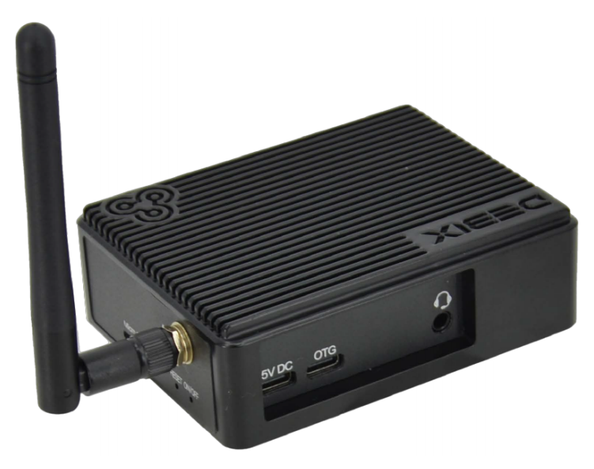
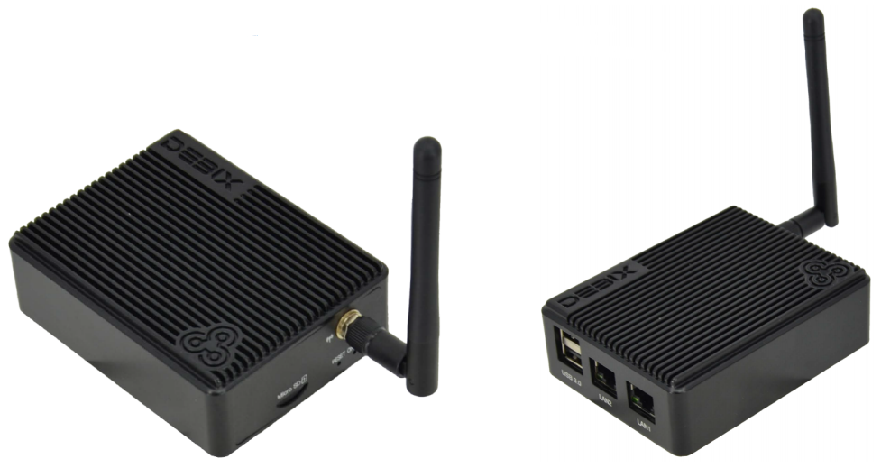
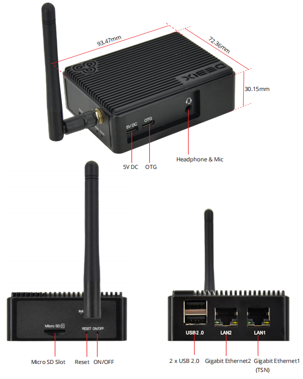

# DEBIX BPC-iMX93-01 Industrial Computer

## Overview
BPC-iMX93-01 is a fanless mini box pc utilizing DEBIX Model C SBC for default. It's an easy to use computer with an external Wi-Fi&BT antenna, a 5V DC power adapter and a Micro SD card pre-installed with the image (eMMC optional). Insert the Micro SD card, press the ON/OFF button, then you power it on.

## Main Features
- Compact size, durable aluminum alloy case
- Fanless design with increased surface area for enhanced heat dissipation
- Dual-Gigabit Ethernet network and two USB 2.0 to bring an efficient data transmission 
speed
-1 x 3.5mm headphone and mic combo
- 1 x Wi-Fi&BT antenna
- With NXP i.MX 93 processor 1.7GHz and a full load power consumption of 1W
- For IoT edge, contactless HMI, smart home, building control and industrial applications
- Supports system switching between Ubuntu, Yocto and Debian

## Specification
| System          |       |
|-----------------|-------|
| Motherboard | DEBIX Model C |
| Memory|1GB LPDDR4 (2GB optional)
|Storage|8GB/16GB/32GB/64GB/128GB/256GB Micro SD card (eMMC optional)
|OS| Ubuntu 22.04 Server, Yocto-L6.1.36, Debian 12 Server (also supports OpenWRT 
and FreeRTOS) |
|**I/O Interfaces**|
| Gigabit Ethernet| 2 x Gigabit Ethernet ports, one supports TSN and PoE (PoE module is needed) |
| Wi-Fi & Bluetooth| 2.4GHz & 5GHz Wi-Fi and Bluetooth 5.2, external SMA antenna for Wi-Fi&BT |
|USB|1 x Type-C USB for DC 5V power input 1 x Type-C USB as a USB OTG 2 x USB 2.0 Host Type-A
|Audio| 1 x 3.5mm Headphone and Mic combo port
|Slot|1 x Micro SD Slot
|KEY|1 x RESET KEY 1 x ON/OFF KEY
|**Power Supply**|
| Power Input | DC 5V/2A |
|**Mechanical & Environmental**|
| Enclosure Material | Aluminum alloy  |
| Dimension | 93.47mm x 72.36mm x 30.15mm (±0.5mm) |
| Weight | 192g (±0.5g)  |
| Operating Temp. | -20°C to 70°C (-40°C to 85°C optional) |

## I/O Interfaces and Dimension:

## Ordering Codes
| RAM LPDDR4  | eMMC Storage | PN for BPC-iMX93-01 -20°C to 70°C | PN for BPC-iMX93-01 -40°C to 85°C |
|-------------|--------------|----------------|---------------------|
| **1GB DDR** | Lite  |                      | BPC-iMX93-01-I-D1E0 |
|             | 8GB   | BPC-iMX93-01-D1E8    | BPC-iMX93-01-I-D1E8 |
|             | 16GB  | BPC-iMX93-01-D1E16   | BPC-iMX93-01-I-D1E16 |
|             | 32GB  | BPC-iMX93-01-D1E32   | BPC-iMX93-01-I-D1E32 |
|             | 64GB  | BPC-iMX93-01-D1E64   | BPC-iMX93-01-I-D1E64 |
| **2GB DDR** |  Lite |                      | BPC-iMX93-01-I-D2E0 |
|             |  8GB  | BPC-iMX93-01-D2E8    | BPC-iMX93-01-I-D2E8 |
|             | 16GB  | BPC-iMX93-01-D2E16   | BPC-iMX93-01-I-D2E16 |
|             | 32GB  | BPC-iMX93-01-D2E32   | BPC-iMX93-01-I-D2E32 |
|             | 64GB  | BPC-iMX93-01-D2E64   | BPC-iMX93-01-I-D2E64 |

## Compatible with DEBIX's Accessories
| Product                     | Model               |
|-----------------------------|---------------------|
| SBC POE Board               | EMB-AS-06           |

## Safety Instructions and Warnings:
**To avoid malfunction or damage to this product please observe the following:**

- Disconnect the device from the DC power supply before cleaning. Use a damp rag. Do not use liquid detergents or spray-on detergents.
  
- Keep the device away from moisture.

- During installation, put the device on a reliable table. It will be damaged if you drop it.

- Before connecting the power supply, ensure that the voltage is in the required range.

- Put the power cable in place to avoid stepping on it.

- If the device is not used for a long time, power it off to avoid damage caused by sudden overvoltage.

- For safety reasons, the device can only be disassembled by professional personnel.

- Do not place the device in a place where the ambient temperature is below -40℃ or above 85℃. This will damage the machine. It needs to be kept in an environment at controlled temperature.

## Contact Us
- **Headquarters**: DEBIX Technology Inc., 8345 Gold River Ct., Las Vegas, NV 89113, USA  
- **Factory**: 5-6/F., East Zone, Shunheda A2 Building, Liqxiandong Industrial Park, XiLi, Nanshan Dist., Shenzhen, China  
- **Email**: info@debix.io  
- **Website**: [www.debix.io](https://www.debix.io)  
- **Community**: [Discord](https://discord.com/invite/adaHHaDkH2)